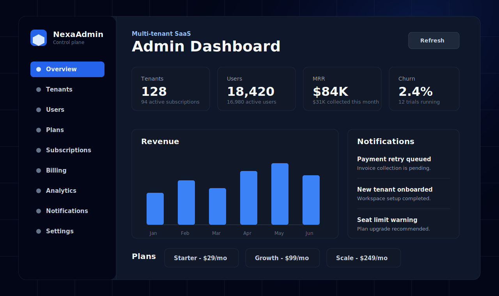
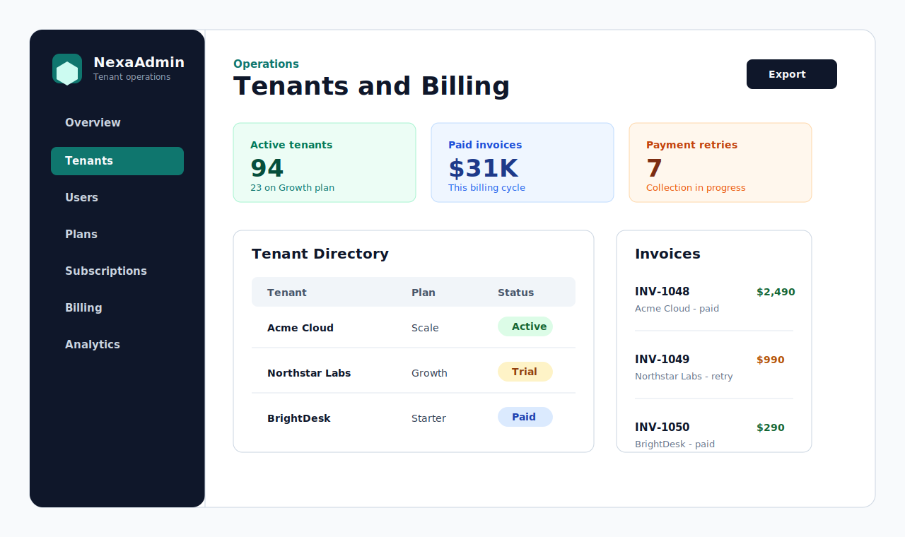
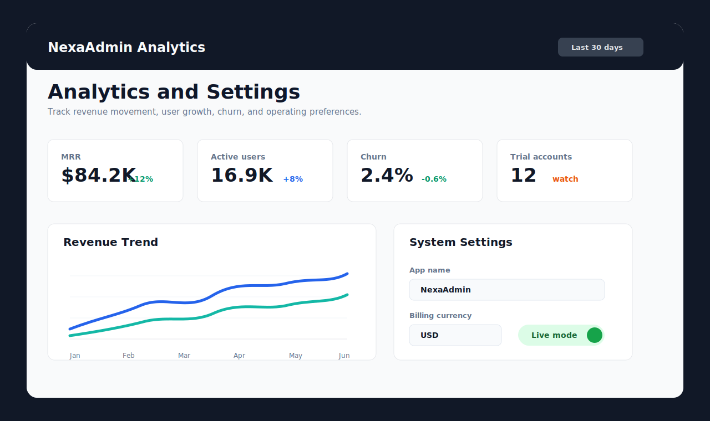

# Multi-Tenant SaaS Admin Dashboard

Modern SaaS admin platform for managing tenants, users, plans, subscriptions, payments, analytics, notifications, and system settings from one centralized dashboard.



## Additional Previews





## Features

- Tenant management with account status, domains, and user counts
- User management with roles, tenant assignment, and activation status
- Plan management with pricing, tiers, feature lists, seat limits, and storage limits
- Subscription management with billing interval, status, seats used, period dates, and MRR
- Payment and billing management with invoices, payment status, refunds, failed payments, and collection totals
- Analytics dashboard with MRR, revenue, active users, churn, revenue trends, and user growth
- Notifications center for billing, trial, signup, seat-limit, milestone, and system alerts
- System settings page for app name, support email, billing currency, and maintenance mode
- Demo data seeding command with a ready-to-use super admin account

## Frontend Routes

- `/` - dashboard overview
- `/tenants` - tenant directory
- `/users` - user directory
- `/plans` - subscription plans
- `/subscriptions` - subscription accounts
- `/billing` - payments and subscriptions
- `/analytics` - analytics and growth
- `/notifications` - notification center
- `/settings` - system settings

## Backend Apps

- `apps.users`
- `apps.plans`
- `apps.subscriptions`
- `apps.payments`
- `apps.analytics`
- `apps.notifications`
- `apps.settings`

## Backend

```powershell
cd backend
..\.venv\Scripts\python.exe manage.py migrate
..\.venv\Scripts\python.exe manage.py seed_sample_data
..\.venv\Scripts\python.exe manage.py runserver 8000
```

Use `backend/.env.example` as the environment reference. By default the backend uses SQLite and local memory cache for development.
The seed command creates demo dashboard data and a super admin login: `admin@nexasaas.io` / `Admin@12345`.

## Frontend

```powershell
cd frontend
npm install
npm run dev
```

The frontend expects the API at `http://localhost:8000/api`. Override it with `NEXT_PUBLIC_API_URL`.

Open the app at `http://localhost:3000`.

## Deployment

### Backend on Render

This repo includes a Render Blueprint at `render.yaml`.

1. Push the repository to GitHub.
2. In Render, create a new Blueprint from the repository.
3. After Render creates the backend service, update these env vars with the real deployed domains:
   - `ALLOWED_HOSTS=your-backend-name.onrender.com`
   - `CORS_ALLOWED_ORIGINS=https://your-frontend.vercel.app`
   - `CSRF_TRUSTED_ORIGINS=https://your-frontend.vercel.app`

Render runs:

```bash
pip install -r requirements.txt && python manage.py collectstatic --no-input
python manage.py migrate && gunicorn saas_admin.wsgi:application
```

Use `backend/.env.example` as the backend environment reference.

### Frontend on Vercel

Deploy the `frontend` directory as the Vercel project root.

Set this Vercel environment variable:

```bash
NEXT_PUBLIC_API_URL=https://your-backend-name.onrender.com/api
```

Then deploy with Vercel's Git integration or from `frontend`:

```bash
npm install
npm run build
vercel --prod
```
